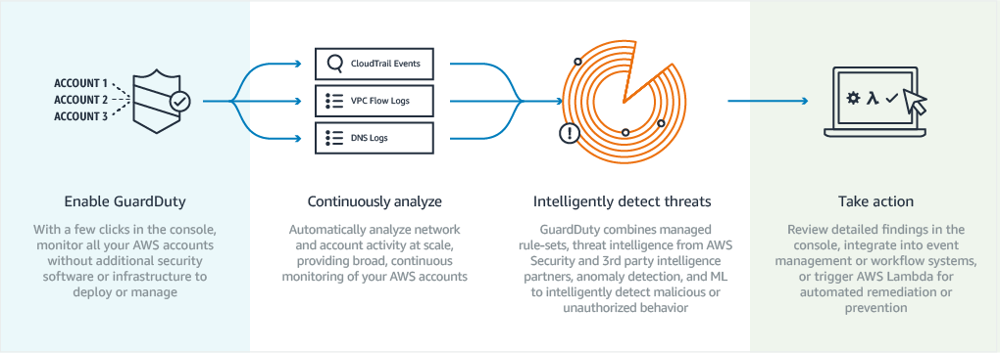

# AWS Accounts

| Account | Account ID | Email | Purpose |
| --- | --- | --- | --- |
| Bastion        | `052941057274` | aws-slack-notifications@ripglobal.com       | Bastion Account                       |
| Production     | `293032512267` | aws-slack-notifications-prod@ripglobal.com  | Production Environment                |
| Test           | `590967854086` | aws-slack-notifications-test@ripglobal.com  | Testing Environment                   |
| Development    | `062185361969` | aws-slack-notifications-dev@ripglobal.com   | Development Environment               |
| Audit          | `` | aws-slack-notifications-audit@ripglobal.com | Audit Account                         |

## Account Hierarchy:

```
.
└── Bastion Account
    ├── Production Account
    ├── Test Account
    └── Development Account

.
└── Audit Account
```

#### Bastion Account Approach

We set up a Bastion Account to store the IAM users, this provides a single central
location for managing credentials and access

## Switching Roles

As we are using a Bastion account we need to switch roles to get to any of our AWS Resources.

Official AWS Documentation:
* [Guide for Switching Roles - Console](https://docs.aws.amazon.com/IAM/latest/UserGuide/id_roles_use_switch-role-console.html)
* [Guide for Switching Roles - CLI](https://docs.aws.amazon.com/IAM/latest/UserGuide/id_roles_use_switch-role-cli.html)

CLI Tool: [coinbase/assume-role](https://github.com/coinbase/assume-role)

### Quick Links

For console switch roles

#### OrganizationAccountAccessRole (Admin)
| Account | Switch Role URL
| --- | --- |
| Production  | https://signin.aws.amazon.com/switchrole?account=293032512267&roleName=OrganizationAccountAccessRole&displayName=Slack-Notifications-Prod |
| Test        | https://signin.aws.amazon.com/switchrole?account=590967854086&roleName=OrganizationAccountAccessRole&displayName=Slack-Notifications-Test |
| Development | https://signin.aws.amazon.com/switchrole?account=062185361969&roleName=OrganizationAccountAccessRole&displayName=Slack-Notifications-Dev |

## Root Access

You may need AWS account ***root*** user access for specific tasks, such as changing an AWS support plan or closing your account. In these cases, sign in to the AWS Management Console with your email and password. [See Email and Password (Root User)](https://docs.aws.amazon.com/general/latest/gr/aws-sec-cred-types.html#email-and-password-for-your-AWS-account).

### [Tasks that require Root](https://docs.aws.amazon.com/general/latest/gr/aws_tasks-that-require-root.html)

## Audit Account

# Audit Account

The Audit account is a dedicated information security account that assumes the responsibility for collecting and analyzing security-related data/logs, 
running compliance scripts, configuring security services (such as CloudTrail and Guard Duty).

This account is split from our Organisation for the purpose of making sure access to it is locked down.

For reference [AWS Multiple account Strategy](https://aws.amazon.com/answers/account-management/aws-multi-account-security-strategy/)

## GuardDuty

We utilise Amazon GuardDuty for intelligent threat detection and monitoring



* [Official Documentation](https://aws.amazon.com/guardduty/)